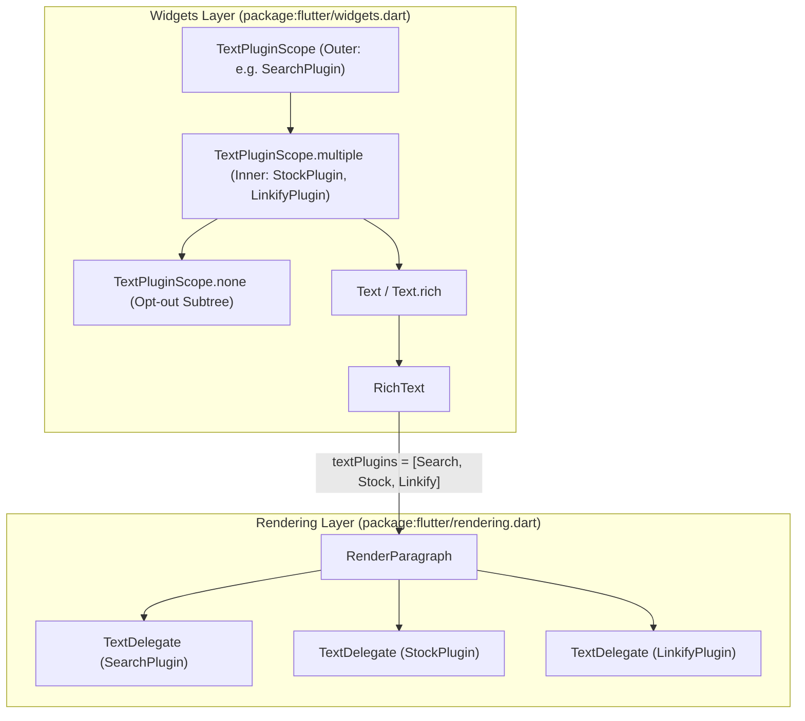
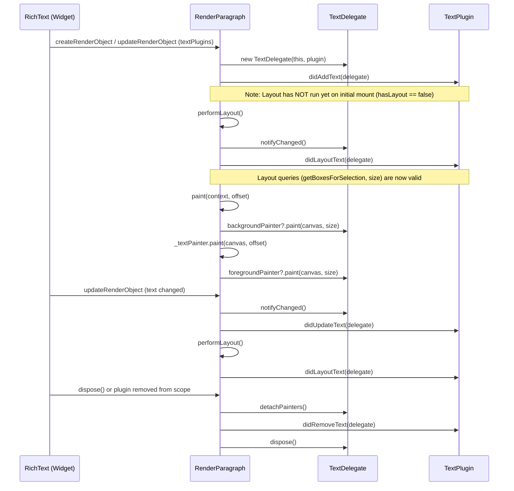
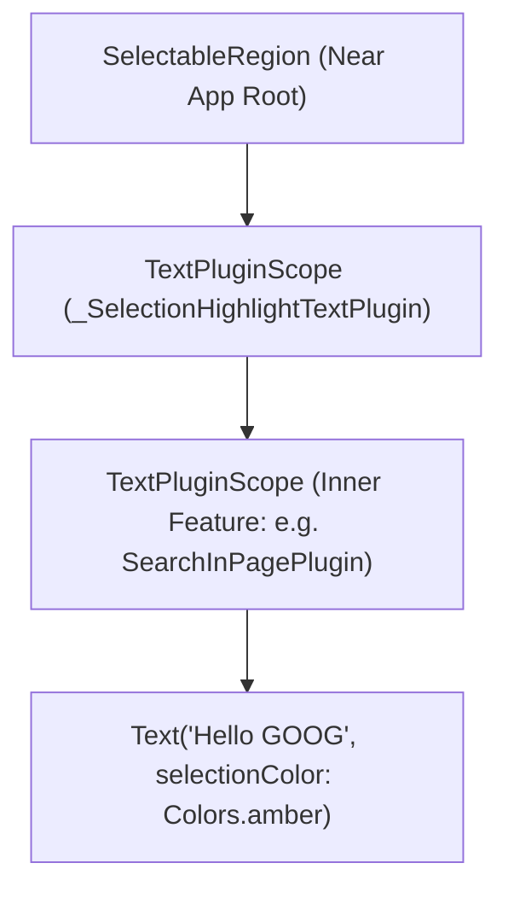

# Design Document: Composable Text Plugins in Flutter

**Author**: Antigravity & User  
**Status**: Implemented Prototype (`packages/flutter` + `examples/text_plugins`)  
**Reference**: [Text-Plugins-One-Pager.md](file:///Users/jinhangyu/Documents/GitHub/flutter/Text-Plugins-One-Pager.md)

---

## 1. Problem Statement & Motivation

Flutter applications frequently need cross-cutting text capabilities that inspect, decorate, or attach interactions to text across an entire page or subtree:

1. **Find-in-Page / Search Highlighting**: Locating all occurrences of a query across disparate [Text](file:///Users/jinhangyu/Documents/GitHub/flutter/packages/flutter/lib/src/widgets/text.dart) and [RichText](file:///Users/jinhangyu/Documents/GitHub/flutter/packages/flutter/lib/src/widgets/basic.dart#L7892-L8098) widgets, painting active/inactive highlights, and scrolling the active match into view.
2. **Entity & Pattern Decoration**: Highlighting and making stock tickers (`GOOG`, `AAPL`), hashtags, mentions, or citations interactive without mutating the source string or requiring callers to pre-tokenize `TextSpan` trees.
3. **Automatic Linkification**: Detecting URLs (`https://...`, `www....`) in plain [Text](file:///Users/jinhangyu/Documents/GitHub/flutter/packages/flutter/lib/src/widgets/text.dart) widgets, painting link underlines, and handling tap gestures.
4. **Live Content & SEO Extraction**: Indexing visible text across a subtree to generate Schema.org JSON-LD metadata, word/reading-time analytics, or crawler snapshots.

### Why Custom `Text` Subclasses Fail

Historically, package authors solved these problems by creating custom drop-in replacement widgets (`LinkifyText`, `SearchableText`, `ParsedText`). This approach breaks down in real applications:

- **Zero Composability**: A developer cannot simultaneously use `LinkifyText` from Package A and `StockTickerText` from Package B on the same paragraph.
- **Invasive Refactoring**: Every [Text](file:///Users/jinhangyu/Documents/GitHub/flutter/packages/flutter/lib/src/widgets/text.dart) widget in the app—including those buried inside third-party widgets or Material/Cupertino components ([ListTile](file:///Users/jinhangyu/Documents/GitHub/flutter/packages/flutter/lib/src/material/list_tile.dart), [Card](file:///Users/jinhangyu/Documents/GitHub/flutter/packages/flutter/lib/src/material/card.dart), [DataTable](file:///Users/jinhangyu/Documents/GitHub/flutter/packages/flutter/lib/src/material/data_table.dart))—would have to be replaced.
- **No Document-Level Coordination**: Individual custom text widgets lack a shared coordinator unless accompanied by bespoke ancestor state management.

> [!IMPORTANT]
> **Core Architectural Insight**: Text cross-cutting concerns belong in an ambient, composable **plugin pipeline** attached via `InheritedWidget` ([TextPluginScope](file:///Users/jinhangyu/Documents/GitHub/flutter/packages/flutter/lib/src/widgets/text_plugin.dart#L30-L117)) and executed directly by [RenderParagraph](file:///Users/jinhangyu/Documents/GitHub/flutter/packages/flutter/lib/src/rendering/paragraph.dart#L317-L1381), leaving standard [Text](file:///Users/jinhangyu/Documents/GitHub/flutter/packages/flutter/lib/src/widgets/text.dart) and [RichText](file:///Users/jinhangyu/Documents/GitHub/flutter/packages/flutter/lib/src/widgets/basic.dart#L7892-L8098) widgets unchanged.

---

## 2. Design Goals & Non-Goals

### Goals
- **Zero-boilerplate adoption**: Existing `Text('...')` and `Text.rich(...)` widgets automatically participate when placed inside a [TextPluginScope](file:///Users/jinhangyu/Documents/GitHub/flutter/packages/flutter/lib/src/widgets/text_plugin.dart#L30-L117).
- **Deterministic multi-plugin composition**: Multiple plugins can inspect, paint behind/in front of, and handle pointer events on the same [RenderParagraph](file:///Users/jinhangyu/Documents/GitHub/flutter/packages/flutter/lib/src/rendering/paragraph.dart#L317-L1381) in a predictable root-to-leaf installation order.
- **Encapsulation of `RenderParagraph`**: Plugins interact with a capability-scoped [TextDelegate](file:///Users/jinhangyu/Documents/GitHub/flutter/packages/flutter/lib/src/rendering/text_plugin.dart#L86-L287) rather than mutating [RenderParagraph](file:///Users/jinhangyu/Documents/GitHub/flutter/packages/flutter/lib/src/rendering/paragraph.dart#L317-L1381) internals directly.
- **Subtree opt-out**: Subtrees (such as toolbars, search inputs, or decorative chrome) can opt out of ancestor plugins via [TextPluginScope.none](file:///Users/jinhangyu/Documents/GitHub/flutter/packages/flutter/lib/src/widgets/text_plugin.dart#L48-L52).
- **Strict layer separation**: Rendering primitives live in `package:flutter/rendering.dart` ([rendering/text_plugin.dart](file:///Users/jinhangyu/Documents/GitHub/flutter/packages/flutter/lib/src/rendering/text_plugin.dart)); widget scoping lives in `package:flutter/widgets.dart` ([widgets/text_plugin.dart](file:///Users/jinhangyu/Documents/GitHub/flutter/packages/flutter/lib/src/widgets/text_plugin.dart)). Neither depends on Material or Cupertino.

### Non-Goals (Current Scope)
- **Mutating the input `InlineSpan` tree or changing text metrics**: Plugins decorate and observe laid-out text via [CustomPainter](file:///Users/jinhangyu/Documents/GitHub/flutter/packages/flutter/lib/src/rendering/custom_paint.dart)s (`backgroundPainter` / `foregroundPainter`); they do not rewrite font sizes or insert layout-shifting inline widgets during layout.
- **Replacing `RenderEditable` (`TextField`) editing pipelines**: Editable text inputs have their own `TextEditingController.buildTextSpan` pipeline and are intentionally separate from static [RenderParagraph](file:///Users/jinhangyu/Documents/GitHub/flutter/packages/flutter/lib/src/rendering/paragraph.dart#L317-L1381) rendering.

---

## 3. Architecture & Component Design



### 3.1 Layering & File Organization

| Layer | File | Public Symbols | Responsibility |
| :--- | :--- | :--- | :--- |
| **Rendering** | [rendering/text_plugin.dart](file:///Users/jinhangyu/Documents/GitHub/flutter/packages/flutter/lib/src/rendering/text_plugin.dart) | [TextPlugin](file:///Users/jinhangyu/Documents/GitHub/flutter/packages/flutter/lib/src/rendering/text_plugin.dart#L44-L71), [TextDelegate](file:///Users/jinhangyu/Documents/GitHub/flutter/packages/flutter/lib/src/rendering/text_plugin.dart#L86-L287) | Defines the plugin lifecycle interface and the per-paragraph delegate handle. |
| **Rendering** | [rendering/paragraph.dart](file:///Users/jinhangyu/Documents/GitHub/flutter/packages/flutter/lib/src/rendering/paragraph.dart) | [RenderParagraph.textPlugins](file:///Users/jinhangyu/Documents/GitHub/flutter/packages/flutter/lib/src/rendering/paragraph.dart#L565-L575) | Reconciles delegates, dispatches lifecycle & pointer events, and executes painters. |
| **Widgets** | [widgets/text_plugin.dart](file:///Users/jinhangyu/Documents/GitHub/flutter/packages/flutter/lib/src/widgets/text_plugin.dart) | [TextPluginScope](file:///Users/jinhangyu/Documents/GitHub/flutter/packages/flutter/lib/src/widgets/text_plugin.dart#L30-L117) | Scopes and merges `TextPlugin` lists down the widget tree via `_InheritedTextPluginScope`. |
| **Widgets** | [widgets/basic.dart](file:///Users/jinhangyu/Documents/GitHub/flutter/packages/flutter/lib/src/widgets/basic.dart) | [RichText.textPlugins](file:///Users/jinhangyu/Documents/GitHub/flutter/packages/flutter/lib/src/widgets/basic.dart#L8035) | Resolves `textPlugins ?? TextPluginScope.maybeOf(context)` and forwards to `RenderParagraph`. |

### 3.2 `TextPlugin` Lifecycle Contract

Defined in [rendering/text_plugin.dart](file:///Users/jinhangyu/Documents/GitHub/flutter/packages/flutter/lib/src/rendering/text_plugin.dart#L44-L71), `TextPlugin` exposes five hooks:

```dart
abstract class TextPlugin {
  const TextPlugin();

  void didAddText(TextDelegate delegate) {}
  void didUpdateText(TextDelegate delegate) {}
  void didLayoutText(TextDelegate delegate) {}
  void didRemoveText(TextDelegate delegate) {}
  void handlePointerEvent(TextDelegate delegate, PointerEvent event) {}
}
```



### 3.3 `TextDelegate`: Capability-Scoped Proxy for `RenderParagraph`

Instead of passing [RenderParagraph](file:///Users/jinhangyu/Documents/GitHub/flutter/packages/flutter/lib/src/rendering/paragraph.dart#L317-L1381) directly to plugins—which would allow plugins to corrupt layout state, mutate constraints, or overwrite each other's painters—each `(RenderParagraph, TextPlugin)` pair gets its own [TextDelegate](file:///Users/jinhangyu/Documents/GitHub/flutter/packages/flutter/lib/src/rendering/text_plugin.dart#L86-L287) instance:

- **Isolated Painter Slots**: Each [TextDelegate](file:///Users/jinhangyu/Documents/GitHub/flutter/packages/flutter/lib/src/rendering/text_plugin.dart#L86-L287) owns its own [backgroundPainter](file:///Users/jinhangyu/Documents/GitHub/flutter/packages/flutter/lib/src/rendering/text_plugin.dart#L153-L162) and [foregroundPainter](file:///Users/jinhangyu/Documents/GitHub/flutter/packages/flutter/lib/src/rendering/text_plugin.dart#L141-L150). Setting or replacing a painter checks `shouldRepaint`, attaches/detaches the painter's `Listenable` (`addListener(_paragraph.markNeedsPaint)`), and calls `markNeedsPaint()` only when needed.
- **Content Inspection**:
  - [delegate.text](file:///Users/jinhangyu/Documents/GitHub/flutter/packages/flutter/lib/src/rendering/text_plugin.dart#L102): Returns `_paragraph.text.toPlainText(includeSemanticsLabels: false)` so plugins see the exact UTF-16 character stream laid out by `TextPainter` (without `semanticsLabel` overrides corrupting character offsets).
  - [delegate.textSpan](file:///Users/jinhangyu/Documents/GitHub/flutter/packages/flutter/lib/src/rendering/text_plugin.dart#L106): Exposes the raw `InlineSpan` tree for plugins that need style or span-structure inspection.
- **Layout & Coordinate Queries**:
  - [hasLayout](file:///Users/jinhangyu/Documents/GitHub/flutter/packages/flutter/lib/src/rendering/text_plugin.dart#L125) (`_paragraph.hasSize && !_paragraph.debugNeedsLayout`), [hasSize](file:///Users/jinhangyu/Documents/GitHub/flutter/packages/flutter/lib/src/rendering/text_plugin.dart#L117), and [size](file:///Users/jinhangyu/Documents/GitHub/flutter/packages/flutter/lib/src/rendering/text_plugin.dart#L130).
  - [getBoxesForSelection](file:///Users/jinhangyu/Documents/GitHub/flutter/packages/flutter/lib/src/rendering/text_plugin.dart#L183-L193), [getPositionForOffset](file:///Users/jinhangyu/Documents/GitHub/flutter/packages/flutter/lib/src/rendering/text_plugin.dart#L199-L201), [getWordBoundary](file:///Users/jinhangyu/Documents/GitHub/flutter/packages/flutter/lib/src/rendering/text_plugin.dart#L206-L208), [getOffsetForCaret](file:///Users/jinhangyu/Documents/GitHub/flutter/packages/flutter/lib/src/rendering/text_plugin.dart#L214-L216), and [getFullHeightForCaret](file:///Users/jinhangyu/Documents/GitHub/flutter/packages/flutter/lib/src/rendering/text_plugin.dart#L221-L223).
  - Coordinate conversion & scrolling helpers: [localToGlobal](file:///Users/jinhangyu/Documents/GitHub/flutter/packages/flutter/lib/src/rendering/text_plugin.dart#L234-L236), [globalToLocal](file:///Users/jinhangyu/Documents/GitHub/flutter/packages/flutter/lib/src/rendering/text_plugin.dart#L241-L243), [getTransformTo](file:///Users/jinhangyu/Documents/GitHub/flutter/packages/flutter/lib/src/rendering/text_plugin.dart#L227-L229), and [showOnScreen](file:///Users/jinhangyu/Documents/GitHub/flutter/packages/flutter/lib/src/rendering/text_plugin.dart#L247-L249) (enabling find-in-page plugins to auto-scroll the active match into the viewport).

### 3.4 `TextPluginScope` & Hierarchical Merging

[TextPluginScope](file:///Users/jinhangyu/Documents/GitHub/flutter/packages/flutter/lib/src/widgets/text_plugin.dart#L30-L117) uses an internal `InheritedWidget` (`_InheritedTextPluginScope`) that eagerly computes the merged, deduplicated list of plugins from root to leaf during `build`:

1. **Single & Multiple Registration**: `TextPluginScope(plugin: p, child: ...)` and `TextPluginScope.multiple(plugins: [p1, p2], child: ...)` look up `TextPluginScope.of(context)` and append their plugins after any ancestor plugins.
2. **Root-to-Leaf Deduplication**: If a plugin instance is already present in an ancestor scope, it retains its outer position so each `(RenderParagraph, TextPlugin)` pair is 1-to-1.
3. **Subtree Opt-Out (`TextPluginScope.none`)**: Installs an `_InheritedTextPluginScope` with `plugins: const <TextPlugin>[]`, shadowing all ancestor scopes for its `child` subtree.

### 3.5 `RenderParagraph` Painting & Z-Order Pipeline

Within [RenderParagraph.paint](file:///Users/jinhangyu/Documents/GitHub/flutter/packages/flutter/lib/src/rendering/paragraph.dart#L1218-L1319), layers are painted in the following strict Z-order (from back to front):

1. **Plugin `backgroundPainter`s** (in root-to-leaf plugin installation order, clipped to `offset & size` if `_needsClipping` is true).
2. **Selection highlights** (`_lastSelectableFragments` when inside a `SelectionArea` / `SelectableRegion`).
3. **Paragraph glyphs & inline children** (`_textPainter.paint` and `paintInlineChildren`, with overflow shader/clipping if applicable).
4. **Plugin `foregroundPainter`s** (in root-to-leaf plugin installation order, clipped if `_needsClipping` is true).
5. **Selection handles** (`_lastSelectableFragments` drag handles).

---

## 4. Exhaustive Corner Cases & Architectural Analysis

Below are the 14 critical corner cases identified during design and implementation, how our implementation handles them today, and what additional safeguards or trade-offs apply.

### Corner Case 1: `ChangeNotifier` / `setState` Re-entrancy During Build, Layout, and Dispose

**The Problem**:  
`TextPlugin` callbacks are invoked synchronously inside rendering pipeline phases:
- `didAddText` and `didUpdateText` run during `RichText.createRenderObject` and `RichText.updateRenderObject` (**Widget Build phase**, `SchedulerPhase.persistentCallbacks`).
- `didLayoutText` runs at the end of `RenderParagraph.performLayout` (**Layout phase**, also `SchedulerPhase.persistentCallbacks`).
- `didRemoveText` runs during `RenderParagraph.dispose` (**Finalize Tree phase**, `SchedulerPhase.persistentCallbacks`).

If a `TextPlugin` is also a `ChangeNotifier` (or calls a callback that triggers `setState` on an ancestor widget, such as a search bar showing `"1 / 4 matches"` or an SEO inspector showing `"7 Text Widgets"`), calling `notifyListeners()` synchronously inside `didAddText`, `didLayoutText`, or `didRemoveText` throws a framework assertion:
> `setState() or markNeedsBuild() called during build.`

**How We Solved It**:
- **Painter updates happen synchronously**: Setting `delegate.backgroundPainter = ...` only calls `RenderParagraph.markNeedsPaint()`, which is completely legal during build and layout (before the paint phase).
- **External UI notifications are coalesced to post-frame**: In stateful plugins like [SearchInPagePlugin._scheduleNotify](file:///Users/jinhangyu/Documents/GitHub/flutter/examples/text_plugins/lib/plugins/search_in_page_plugin.dart#L194-L208) and [SeoExtractorPlugin._scheduleNotify](file:///Users/jinhangyu/Documents/GitHub/flutter/examples/text_plugins/lib/plugins/seo_extractor_plugin.dart#L82-L96), if `SchedulerBinding.instance.schedulerPhase == SchedulerPhase.persistentCallbacks`, `notifyListeners()` is deferred and coalesced via `SchedulerBinding.instance.addPostFrameCallback`, whereas interactive updates (e.g., typing in the search field during `SchedulerPhase.idle`) notify listeners immediately.

---

### Corner Case 2: Calling Layout Queries in `didAddText` or `didUpdateText` (`!delegate.hasLayout`)

**The Problem**:  
When `didAddText(delegate)` is called during `RichText.createRenderObject`, `RenderParagraph.performLayout()` has **not** run yet (`!_paragraph.hasSize`). Similarly, when `RichText.updateRenderObject` mutates `RenderParagraph.text`, `markNeedsLayout()` is called before `didUpdateText(delegate)`, so `_paragraph.debugNeedsLayout` is `true`. Calling `delegate.getBoxesForSelection(...)` or `delegate.size` inside `didAddText` or `didUpdateText` will fail with a `!debugNeedsLayout` assertion in `RenderParagraph`.

**How We Solved It**:
1. Exposed [TextDelegate.hasLayout](file:///Users/jinhangyu/Documents/GitHub/flutter/packages/flutter/lib/src/rendering/text_plugin.dart#L125) (`_paragraph.hasSize && !_paragraph.debugNeedsLayout`).
2. Added the explicit [TextPlugin.didLayoutText](file:///Users/jinhangyu/Documents/GitHub/flutter/packages/flutter/lib/src/rendering/text_plugin.dart#L62) lifecycle hook invoked at the end of `RenderParagraph.performLayout()` (and immediately in `_updateTextPlugins` if a new plugin is attached to an already-laid-out `RenderParagraph`).
3. Designed plugin `CustomPainter`s to query `delegate.getBoxesForSelection(...)` lazily inside `CustomPainter.paint(Canvas canvas, Size size)` (guarded by `if (!delegate.hasLayout) return;`), where layout is guaranteed to be up to date.

---

### Corner Case 3: Embedded `WidgetSpan`s (`PlaceholderSpan`) and UTF-16 Offset Alignment

**The Problem**:  
A `Text.rich` widget can contain inline `WidgetSpan` children (e.g., an inline icon or badge):
```dart
Text.rich(
  TextSpan(
    children: [
      TextSpan(text: 'Buy '),
      WidgetSpan(child: Icon(Icons.trending_up)),
      TextSpan(text: ' GOOG today'),
    ],
  ),
)
```
Inside `TextPainter` and native `ui.Paragraph`, every `PlaceholderSpan` occupies **1 UTF-16 code unit** represented by the Unicode Object Replacement Character `\uFFFC` (`0xFFFC`).
- If `delegate.text` omitted placeholders (`includePlaceholders: false`), `' GOOG today'` would start at index `4` in `delegate.text`, but at offset `5` in `TextPainter`! Passing `TextSelection(baseOffset: 4, extentOffset: 8)` to `getBoxesForSelection` would highlight `'GOO'` instead of `'GOOG'`.
- Conversely, if `delegate.text` used `includeSemanticsLabels: true` (the default of `InlineSpan.toPlainText()`), a `TextSpan(text: 'GOOG', semanticsLabel: 'Alphabet Inc.')` would return `'Alphabet Inc.'` in `delegate.text`, completely desynchronizing string indices from `TextPainter` glyph offsets!

**How We Solved It**:
- [TextDelegate.text](file:///Users/jinhangyu/Documents/GitHub/flutter/packages/flutter/lib/src/rendering/text_plugin.dart#L102) explicitly calls:
  ```dart
  String get text => _paragraph.text.toPlainText(includeSemanticsLabels: false);
  ```
  which keeps `includePlaceholders: true` (emitting `\uFFFC` for each `PlaceholderSpan`) and sets `includeSemanticsLabels: false`. This guarantees a **1-to-1 UTF-16 offset correspondence** between `delegate.text` indices and `TextSelection` / `TextPosition` offsets in `TextPainter`.

> [!TIP]
> Plugin authors writing regex matchers should note that `\uFFFC` is not a word character (`\w`) or whitespace (`\s`), so patterns like `\bGOOG\b` naturally treat adjacent `WidgetSpan`s as word boundaries without shifting character indices.

---

### Corner Case 4: Text Truncation (`maxLines`, `TextOverflow.ellipsis`, `TextOverflow.clip`, `TextOverflow.fade`)

**The Problem**:  
Suppose a `Text` widget has `maxLines: 1, overflow: TextOverflow.ellipsis` and a 500-character string where `'GOOG'` appears at character 400 (which is truncated behind `'...'`):
1. `delegate.text` returns the full 500-character string from `InlineSpan.toPlainText`, so a regex in `SearchInPagePlugin` or `StockTickerPlugin` will still find `'GOOG'` at offset `400..404`.
2. What happens when the plugin queries `delegate.getBoxesForSelection(TextSelection(baseOffset: 400, extentOffset: 404))`?
   - For characters completely past the ellipsis cutoff, `ui.Paragraph.getBoxesForRange` returns either an empty list `[]` or a collapsed zero-width box at the ellipsis end.
   - For a match that *straddles* the ellipsis cutoff (e.g., `'https://flut...'`), `getBoxesForSelection` returns the box for the visible prefix (`'https://flut'`).
3. What if a plugin's `CustomPainter` draws a rounded badge (`inflate(2.0)`) that extends outside `RenderParagraph.size` when `_needsClipping` is true?

**How We Solved It**:
- In [RenderParagraph.paint](file:///Users/jinhangyu/Documents/GitHub/flutter/packages/flutter/lib/src/rendering/paragraph.dart#L1235-L1247) and [L1299-L1311](file:///Users/jinhangyu/Documents/GitHub/flutter/packages/flutter/lib/src/rendering/paragraph.dart#L1299-L1311), when `_needsClipping` is `true` (`TextOverflow.clip`, `TextOverflow.ellipsis`, `TextOverflow.fade`), both `backgroundPainter` and `foregroundPainter` passes are clipped to `offset & size` via `context.canvas.clipRect(offset & size)`.
- **Future Enhancement**: Exposing `bool didExceedMaxLines` or `TextRange getVisibleTextRange()` on `TextDelegate` would allow search/SEO plugins to distinguish between *logical* text and *visually non-truncated* text when desired.

---

### Corner Case 5: Multi-Line Wrapping, Bidirectional (BiDi) Text, and Surrogate Pairs

**The Problem**:  
1. **Multi-Line & BiDi Discontinuity**: A single logical substring (e.g., a long URL wrapping across two lines, or an English phrase embedded inside an Arabic/Hebrew RTL paragraph) does **not** map to a single `Rect`. `getBoxesForSelection` returns multiple `ui.TextBox` instances—one per line fragment and BiDi directional run.
2. **UTF-16 Surrogate Pairs & Grapheme Clusters**: Dart `String` indices and `TextSelection` offsets are UTF-16 code units. Characters outside the Basic Multilingual Plane (such as emojis `🚀` or flags `🇺🇸`) occupy 2 or more UTF-16 code units. A naive substring search that splits a surrogate pair or combining mark could request boxes for half a grapheme cluster.

**How We Solved It**:
- All demo plugins ([SearchInPagePlugin](file:///Users/jinhangyu/Documents/GitHub/flutter/examples/text_plugins/lib/plugins/search_in_page_plugin.dart#L219-L263), [StockTickerPlugin](file:///Users/jinhangyu/Documents/GitHub/flutter/examples/text_plugins/lib/plugins/stock_ticker_plugin.dart#L204-L266), [LinkifyPlugin](file:///Users/jinhangyu/Documents/GitHub/flutter/examples/text_plugins/lib/plugins/linkify_plugin.dart#L158-L210)) iterate over **every** `ui.TextBox` returned by `delegate.getBoxesForSelection(...)` for both painting and pointer hit-testing (`boxes.any((box) => box.toRect().contains(localPosition))`).
- When scrolling a multi-line match into view ([SearchInPagePlugin._scrollToActiveMatch](file:///Users/jinhangyu/Documents/GitHub/flutter/examples/text_plugins/lib/plugins/search_in_page_plugin.dart#L179-L192)), the bounding union (`boxes.map((b) => b.toRect()).reduce((a, b) => a.expandToInclude(b))`) is computed and passed to `delegate.showOnScreen(rect: bounds)`.

---

### Corner Case 6: Dynamic Plugin List Reconciliation & Stateful Delegate Preservation

**The Problem**:  
Suppose a user toggles a single plugin on or off in `TextPluginScope.multiple(plugins: _activePlugins, ...)`, changing the active plugin list from `[stockPlugin, linkifyPlugin, searchPlugin]` to `[stockPlugin, linkifyPlugin]`.
If `RenderParagraph` naively disposed all delegates and recreated them whenever `textPlugins` changed:
- `stockPlugin` and `linkifyPlugin` would receive spurious `didRemoveText` + `didAddText` calls on every toggle.
- Any per-delegate state cached by `stockPlugin` (such as an ongoing animation or pointer-down tracking in `_pointerDownPositions[delegate]`) would be lost.

**How We Solved It**:
In [RenderParagraph._updateTextPlugins](file:///Users/jinhangyu/Documents/GitHub/flutter/packages/flutter/lib/src/rendering/paragraph.dart#L569-L629):
1. We diff the old `_textPluginDelegates` keys against `newPlugins`.
2. **Removed plugins**: Only plugins no longer present in `newPlugins` have their `TextDelegate` detached, notified via `plugin.didRemoveText(delegate)`, and disposed.
3. **Retained plugins**: Plugins present in both the old and new lists keep their exact existing `TextDelegate` instance (and its attached painters), re-indexed into `orderedDelegates` to match the new installation order.
4. **Newly added plugins**: Only newly added plugins receive a fresh `TextDelegate`, `didAddText(delegate)`, and (if already laid out) `didLayoutText(delegate)`.

---

### Corner Case 7: Duplicate Plugin Instances Across Nested `TextPluginScope`s

**The Problem**:  
What if a widget tree accidentally mounts the same `TextPlugin` instance twice—either twice in `TextPluginScope.multiple(plugins: [pluginA, pluginA])` or in both an outer `TextPluginScope(plugin: pluginA)` and an inner `TextPluginScope(plugin: pluginA)`?
If `RenderParagraph` created two `TextDelegate`s for the same `pluginA`, `pluginA.didAddText` would be called twice for the same paragraph, its painter would paint twice (doubling alpha opacity on semi-transparent highlights!), and `pluginA.handlePointerEvent` would fire twice per tap!

**How We Solved It**:
- We enforce deduplication at **both** layers:
  1. [TextPluginScope.build](file:///Users/jinhangyu/Documents/GitHub/flutter/packages/flutter/lib/src/widgets/text_plugin.dart#L93-L99) deduplicates `combined` using a `Set<TextPlugin>` while preserving first-seen (outermost/root-most) order.
  2. [RenderParagraph._updateTextPlugins](file:///Users/jinhangyu/Documents/GitHub/flutter/packages/flutter/lib/src/rendering/paragraph.dart#L605-L608) also guards with `if (orderedDelegates.containsKey(plugin)) continue;` in case a caller passes duplicate plugins directly to `RichText(textPlugins: [...])`.

---

### Corner Case 8: Pointer Event Routing, Multi-Plugin Conflicts, and Scroll Gesture Slop

**The Problem**:  
`RenderParagraph.handleEvent` forwards `PointerEvent`s to all active plugins in installation order. Several subtle interaction edge cases arise:
1. **Scroll vs. Tap Disambiguation**: Inside a `SingleChildScrollView` or `ListView`, a user might press their finger down on a highlighted link (`https://flutter.dev`) or stock ticker (`GOOG`) and drag to scroll. If a plugin triggered on `PointerDownEvent` or unconditionally on `PointerUpEvent`, scrolling the page would accidentally open links/modals!
2. **Overlapping Matches Across Plugins**: What if a search query highlights `'flutter'` inside `'https://flutter.dev'`, or two interactive plugins match overlapping ranges?
3. **Built-in `TextSpan.recognizer` Coexistence**: What if a `Text.rich` already has a `TapGestureRecognizer` on a `TextSpan`?

**How We Solved It**:
- **Touch Slop & Cancel Handling**: Both [StockTickerPlugin.handlePointerEvent](file:///Users/jinhangyu/Documents/GitHub/flutter/examples/text_plugins/lib/plugins/stock_ticker_plugin.dart#L99-L130) and [LinkifyPlugin.handlePointerEvent](file:///Users/jinhangyu/Documents/GitHub/flutter/examples/text_plugins/lib/plugins/linkify_plugin.dart#L75-L103) record `event.localPosition` on `PointerDownEvent`, clear it on `PointerCancelEvent`, and on `PointerUpEvent` verify `(event.localPosition - downPos).distance <= kTouchSlop` before firing their tap callback.
- **`TextSpan.recognizer` Coexistence**: In [RenderParagraph.hitTestChildren](file:///Users/jinhangyu/Documents/GitHub/flutter/packages/flutter/lib/src/rendering/paragraph.dart#L973-L993), if a `TextSpan` implements `HitTestTarget` (i.e., has a `GestureRecognizer`), it is added to the `HitTestResult` *before* `RenderParagraph` itself, and `RenderParagraph.hitTestSelf` returns `true` so both the span's recognizer and `RenderParagraph.handleEvent` receive the pointer event.
- **Future Enhancement**: If mutually exclusive gesture consumption between plugins is needed, `TextDelegate` can expose a gesture arena helper or `bool handlePointerEvent` return value to allow an earlier plugin to consume an event.

---

### Corner Case 9: `SelectionArea` / `SelectableRegion` Coexistence

**The Problem**:  
When a `Text` widget is inside both a `SelectionArea` and a `TextPluginScope`, both `RenderParagraph`'s `_SelectableFragment`s and `TextDelegate` painters are active on the same `RenderParagraph`.
- If a plugin's `backgroundPainter` painted *on top of* the user's text selection highlight, an opaque plugin badge would obscure the user's blue selection rectangle.
- If a plugin's `foregroundPainter` painted *on top of* selection drag handles, the handles could be partially covered.

**How We Solved It**:
- As shown in [RenderParagraph.paint](file:///Users/jinhangyu/Documents/GitHub/flutter/packages/flutter/lib/src/rendering/paragraph.dart#L1231-L1319):
  - Plugin `backgroundPainter`s paint **behind** `_SelectableFragment.paintSelection`, so user text selection remains visible over plugin background tints.
  - Plugin `foregroundPainter`s paint **in front of** glyphs (for underlines/overlays) but **behind** `_SelectableFragment.paintHandles`.

---

### Corner Case 10: Unintended Capture of UI Chrome & `TextPluginScope.none`

**The Problem**:  
In Flutter, almost every widget uses [Text](file:///Users/jinhangyu/Documents/GitHub/flutter/packages/flutter/lib/src/widgets/text.dart) and [RichText](file:///Users/jinhangyu/Documents/GitHub/flutter/packages/flutter/lib/src/widgets/basic.dart#L7892-L8098) internally: `AppBar` titles, `FilledButton` labels, `FilterChip` labels, `Tooltip` popups, `SnackBar` messages, and `TextField` hint/label/counter text.
If a developer wraps their entire `MaterialApp` or `Scaffold` in a `TextPluginScope(plugin: searchPlugin, ...)`:
- Searching for `'Add'` will highlight the `'Add Text'` button label!
- Even worse, if the search bar itself is inside the `TextPluginScope` and displays `'1 / 4'`, typing `'1'` in the search bar will match the search bar's own match counter!

**How We Solved It**:
1. Provided [TextPluginScope.none](file:///Users/jinhangyu/Documents/GitHub/flutter/packages/flutter/lib/src/widgets/text_plugin.dart#L48-L52) as a declarative firewall that strips all ancestor `TextPlugin`s for its `child` subtree.
2. In [examples/text_plugins/lib/main.dart](file:///Users/jinhangyu/Documents/GitHub/flutter/examples/text_plugins/lib/main.dart#L445-L590), we demonstrate two best-practice patterns:
   - Scoping `TextPluginScope.multiple` around the **content body** rather than the entire `Scaffold` chrome.
   - Wrapping embedded interactive controls inside the content body (such as the "Add Text" `TextField` + `FilledButton` row and the explicit Opt-Out Zone card) in `TextPluginScope.none`.

---

### Corner Case 11: Static Text (`RenderParagraph`) vs. Editable Text (`RenderEditable`)

**The Problem**:  
What happens when a `TextField` or `EditableText` is placed inside a `TextPluginScope`?
- The editable text buffer inside `EditableText` is rendered by `RenderEditable`, **not** `RenderParagraph`.
- However, `TextField`'s `InputDecoration` (`hintText`, `labelText`, `helperText`, `errorText`, `prefixText`, `suffixText`) **is** rendered using standard `Text` -> `RichText` -> `RenderParagraph` widgets!
- Consequently, a `TextField` inside a `TextPluginScope` will have its `hintText` and `labelText` inspected by plugins, while the user's typed text in `RenderEditable` will not be inspected unless `TextField` is wrapped in `TextPluginScope.none` (or `RenderEditable` is separately wired to `TextPlugin`).

**Recommendation**:  
Form controls (`TextField`, `DropdownButton`) inside a `TextPluginScope` should typically be wrapped in `TextPluginScope.none` (or `InputDecoration` could wrap its internal labels/hints in `TextPluginScope.none` at the framework level if desired).

---

### Corner Case 12: Lazy Slivers (`ListView.builder`) & Offscreen Viewport Recycling

**The Problem**:  
In a `ListView.builder` or `CustomScrollView` with 1,000 paragraphs, Flutter only builds and mounts `RenderParagraph` instances for items currently inside the viewport + `cacheExtent`.
- As the user scrolls down, top paragraphs are disposed (`didRemoveText` fires) and bottom paragraphs are mounted (`didAddText` + `didLayoutText` fire).
- For **visual decoration plugins** (`StockTickerPlugin`, `LinkifyPlugin`), this works automatically and with $O(\text{visible items})$ memory overhead!
- For **document-wide aggregation plugins** (`SearchInPagePlugin`, `SeoExtractorPlugin`), only currently mounted `RenderParagraph`s exist in the render tree. When an item scrolls offscreen and is disposed, `didRemoveText` removes its matches from the count.

**Mitigation Strategies for Document-Wide Plugins**:
- Use `SingleChildScrollView` or `KeepAlive` (`AutomaticKeepAliveClientMixin`) when full-document DOM-like persistence is required.
- When `SearchInPagePlugin` updates its match list after a scroll or text mutation, [SearchInPagePlugin._recomputeAllMatches](file:///Users/jinhangyu/Documents/GitHub/flutter/examples/text_plugins/lib/plugins/search_in_page_plugin.dart#L140-L157) clamps `_activeMatchIndex` so dynamic additions or removals never cause an `IndexError`.

---

### Corner Case 13: Canvas State Corruption in Plugin `CustomPainter`s

**The Problem**:  
Because all plugin `backgroundPainter`s and `foregroundPainter`s share the `PaintingContext.canvas` with `RenderParagraph`, a buggy plugin painter that calls `canvas.save()` without `canvas.restore()`, or mutates the canvas transform without restoring, could corrupt the rendering of subsequent plugins, the paragraph text itself, or sibling widgets in the same repaint boundary.

**How We Solved It**:
- [RenderParagraph._paintWithCustomPainter](file:///Users/jinhangyu/Documents/GitHub/flutter/packages/flutter/lib/src/rendering/paragraph.dart#L1164-L1210) wraps every individual plugin painter invocation in its own `canvas.save()` / `canvas.translate(offset.dx, offset.dy)` / `canvas.restore()` pair.
- In debug mode, it records `canvas.getSaveCount()` before and after `painter.paint(canvas, size)` and throws a descriptive `FlutterError` pinpointing the exact offending `CustomPainter` if its `save()`/`restore()` calls are unbalanced.

---

### Corner Case 14: Accessibility & Semantics Integration

**The Problem**:  
When `LinkifyPlugin` or `StockTickerPlugin` visually turns plain text (`'https://flutter.dev'` or `'GOOG'`) into a clickable region using `foregroundPainter` and `handlePointerEvent`, screen readers (VoiceOver on iOS/macOS, TalkBack on Android) still see a single static `SemanticsNode` for the entire `Text` widget, because `RenderParagraph.assembleSemanticsNode` only splits semantics nodes for `InlineSpanSemanticsInformation` produced by `TextSpan.recognizer` or `WidgetSpan`.

**Future Extension Path**:
- Extend [TextDelegate](file:///Users/jinhangyu/Documents/GitHub/flutter/packages/flutter/lib/src/rendering/text_plugin.dart#L86-L287) with an optional list of semantic annotations (e.g., `List<TextPluginSemanticAnnotation> semanticsAnnotations` specifying `TextRange`, `label`, `isLink`, and `VoidCallback? onTap`).
- Merge those ranges inside `RenderParagraph.describeSemanticsConfiguration` / `assembleSemanticsNode` alongside `InlineSpanSemanticsInformation` so plugin-detected links and entities become individually focusable and actionable for assistive technologies.

---

## 5. Deep Dive: Should Selection Highlighting Be a `TextPlugin`?

A natural architectural question is whether Flutter's built-in text selection highlight ([_SelectableFragment.paintSelection](file:///Users/jinhangyu/Documents/GitHub/flutter/packages/flutter/lib/src/rendering/paragraph.dart#L3851-L3867)) should itself be migrated to a [TextPlugin](file:///Users/jinhangyu/Documents/GitHub/flutter/packages/flutter/lib/src/rendering/text_plugin.dart#L44-L71) installed by [SelectableRegion](file:///Users/jinhangyu/Documents/GitHub/flutter/packages/flutter/lib/src/widgets/selectable_region.dart#L240).

### 5.1 What We Gain by Making Selection Highlight a `TextPlugin`

Look at how [_SelectableFragment.paintSelection](file:///Users/jinhangyu/Documents/GitHub/flutter/packages/flutter/lib/src/rendering/paragraph.dart#L3851-L3867) is implemented inside `RenderParagraph` today:

```dart
for (final TextBox textBox in paragraph.getBoxesForSelection(selection)) {
  context.canvas.drawRect(textBox.toRect().shift(offset), selectionPaint);
}
```

Mechanically, this is identical to a `TextPlugin` installing a `backgroundPainter` on [TextDelegate](file:///Users/jinhangyu/Documents/GitHub/flutter/packages/flutter/lib/src/rendering/text_plugin.dart#L86-L287). Extracting selection highlighting into a `TextPlugin` offers three major benefits:

1. **Composable Z-Order**: Instead of hardcoding whether selection highlights paint above or below plugin `backgroundPainter`s in [RenderParagraph.paint](file:///Users/jinhangyu/Documents/GitHub/flutter/packages/flutter/lib/src/rendering/paragraph.dart#L1231-L1319), the Z-order becomes controlled by scope ordering.
2. **Customizable Selection Visuals**: Applications could customize selection rendering (rounded `RRect` selection highlights, gradient highlights, or **multi-user collaborative cursors/selections** as in Google Docs) using standard `TextPlugin`s without modifying `RenderParagraph`.
3. **Decoupling `RenderParagraph`**: Over 2,100 lines of [paragraph.dart](file:///Users/jinhangyu/Documents/GitHub/flutter/packages/flutter/lib/src/rendering/paragraph.dart#L1738-L3923) are dedicated to `_SelectableFragment`. Moving selection highlight painting (and eventually selection state) out of `RenderParagraph` simplifies the core text render object.

---

### 5.2 Corner Cases Discovered When Migrating Selection Highlight (`text-plugins-alt` Analysis)

Prototyping `_SelectionHighlightTextPlugin` inside `SelectableRegion` (as explored in [`Renzo-Olivares:text-plugins-alt`](https://github.com/Renzo-Olivares/flutter/commit/55f5d0af4503fe7950374addd625a5fd9ae8efb5)) reveals five subtle corner cases that must be addressed if selection highlighting is moved to a `TextPlugin`:



#### 1. Root-vs-Leaf Paint Order Inversion
- `SelectionArea` / `SelectableRegion` is almost always mounted near the root of a page or `Scaffold`, while feature plugins (`SearchInPagePlugin`, `StockTickerPlugin`, `LinkifyPlugin`) are mounted inside the page body.
- Under **root-first** painting (outermost scope paints first / at the back), the outer `_SelectionHighlightTextPlugin` paints *behind* inner feature plugins, so an opaque background badge from an inner plugin obscures the user's text selection highlight.
- Conversely, flipping all plugins to **leaf-first** painting (so the outer `SelectableRegion` paints on top) breaks the intuitive widget composition rule where a more specific inner `TextPluginScope` overrides a broader outer `TextPluginScope`.

#### 2. Per-Widget `Text(selectionColor: ...)` Overrides
- Flutter's [Text.selectionColor](file:///Users/jinhangyu/Documents/GitHub/flutter/packages/flutter/lib/src/widgets/text.dart#L713) allows an individual `Text` widget to override `DefaultSelectionStyle.of(context).selectionColor` on its own `RenderParagraph`.
- If `SelectableRegion` installs a single `_SelectionHighlightTextPlugin(color: defaultHighlightColor)` at the root of the selection scope and the painter uses `plugin.color`, per-widget `Text(selectionColor: ...)` overrides are lost unless `TextDelegate` exposes `Color? get selectionColor` from the underlying `RenderParagraph`.

#### 3. Disjoint Selections Across Embedded `WidgetSpan`s
- When a `RenderParagraph` contains inline `WidgetSpan`s (e.g., `"First [WidgetSpan] Second"`), `RenderParagraph` splits itself into multiple [_SelectableFragment](file:///Users/jinhangyu/Documents/GitHub/flutter/packages/flutter/lib/src/rendering/paragraph.dart#L1738)s around each `\uFFFC` placeholder code unit.
- Collapsing `_lastSelectableFragments` into a single `TextSelection?` union (`[minOffset, maxOffset]`) on `TextDelegate` causes two problems:
  1. Calling `getBoxesForSelection` on the union includes the box of the `\uFFFC` placeholder itself unless `includePlaceholders: false` is passed to slice around `placeholderRanges`.
  2. If multi-fragment selection state is non-contiguous across nested selectables, a single union span cannot represent disjoint fragment ranges; exposing `List<TextSelection> get selections` on `TextDelegate` avoids lossy unioning.

#### 4. Legacy Fallback Suppression Bug (`skipLegacyHighlight`)
- To avoid double-painting semi-transparent selection colors when `_SelectionHighlightTextPlugin` is active, `_SelectableFragment.paintSelection` must know whether a plugin is already painting the selection highlight.
- Checking `final bool skipLegacyHighlight = paragraph.textPlugins.isNotEmpty;` is **broken**: if a developer uses a custom `SelectionRegistrar` (without `SelectableRegion`) and installs `LinkifyPlugin`, `textPlugins.isNotEmpty` is `true` and **silently disables selection highlighting** even though no selection highlight plugin is installed!
- **Fix**: Either remove legacy highlight painting from `_SelectableFragment` completely (having `SelectionContainer` always install the selection highlight plugin), or track an explicit `bool handlesSelectionHighlight` flag.

#### 5. Opt-Out Coupling (`TextPluginScope.none` vs. `SelectionContainer.disabled`)
- If `SelectableRegion` relies on `TextPluginScope` to paint selection highlights, wrapping a subtree in [TextPluginScope.none](file:///Users/jinhangyu/Documents/GitHub/flutter/packages/flutter/lib/src/widgets/text_plugin.dart#L48-L52) (for example, to exclude a card from `SeoExtractorPlugin` or `StockTickerPlugin`) will **also disable selection highlight painting** in that subtree, even though `_SelectableFragment` is still registered with `SelectionContainer` and copying text still works invisibly!
- **Fix**: Provide selective opt-out (`TextPluginScope.exclude`) or keep selection highlight registration orthogonal to `TextPluginScope.none`.

---

### 5.3 Why Full Selection (`_SelectableFragment`) Requires More Than `CustomPainter`

While **selection highlight painting** fits into `TextDelegate.backgroundPainter`, the rest of [_SelectableFragment](file:///Users/jinhangyu/Documents/GitHub/flutter/packages/flutter/lib/src/rendering/paragraph.dart#L1738) cannot be moved out of `RenderParagraph` into a pure `TextPlugin` without extending `TextDelegate`:

1. **Mobile Selection Drag Handles Need `PaintingContext.pushLayer`**:
   [_SelectableFragment.paintHandles](file:///Users/jinhangyu/Documents/GitHub/flutter/packages/flutter/lib/src/rendering/paragraph.dart#L3869-L3893) pushes composited `LeaderLayer`s via `context.pushLayer(LeaderLayer(link: _startHandleLayerLink!, ...))` and requires [RenderParagraph.alwaysNeedsCompositing](file:///Users/jinhangyu/Documents/GitHub/flutter/packages/flutter/lib/src/rendering/paragraph.dart#L676) to return `true`. A `CustomPainter` only receives a `Canvas` and cannot push composited layers.
2. **Cross-RenderObject `SelectionRegistrar` Protocol**:
   `SelectionArea` selects across both text (`RenderParagraph`) and non-text `Selectable`s (such as selectable images). Any selection plugin must still bridge its fragments into `SelectionRegistrar`.

### 5.4 Blueprint for Cleanly Extracting Selection into a `TextPlugin`

| Capability Needed | Required API on `TextDelegate` / `TextPluginScope` |
| :--- | :--- |
| **Per-fragment selection & color** | Expose `List<TextSelection> get selections` and `Color? get selectionColor` on `TextDelegate`. |
| **Skip `WidgetSpan` boxes** | Expose `List<TextRange> get placeholderRanges` and `includePlaceholders: false` on `TextDelegate.getBoxesForSelection`. |
| **Mobile drag handle layers** | Allow `TextDelegate` to register `LeaderLayer` handle links `(LayerLink, Offset)` painted during `RenderParagraph.paint` and reflected in `alwaysNeedsCompositing`. |
| **Orthogonal opt-out** | Add `TextPluginScope.exclude(types: {...})` so `TextPluginScope.none` does not inadvertently suppress `SelectionHighlightPlugin`. |

---

## 6. Summary of Files Created & Modified

### Framework (`packages/flutter/`)
- [packages/flutter/lib/src/rendering/text_plugin.dart](file:///Users/jinhangyu/Documents/GitHub/flutter/packages/flutter/lib/src/rendering/text_plugin.dart) — [TextPlugin](file:///Users/jinhangyu/Documents/GitHub/flutter/packages/flutter/lib/src/rendering/text_plugin.dart#L44-L71) and [TextDelegate](file:///Users/jinhangyu/Documents/GitHub/flutter/packages/flutter/lib/src/rendering/text_plugin.dart#L86-L287).
- [packages/flutter/lib/src/widgets/text_plugin.dart](file:///Users/jinhangyu/Documents/GitHub/flutter/packages/flutter/lib/src/widgets/text_plugin.dart) — [TextPluginScope](file:///Users/jinhangyu/Documents/GitHub/flutter/packages/flutter/lib/src/widgets/text_plugin.dart#L30-L117).
- [packages/flutter/lib/src/rendering/paragraph.dart](file:///Users/jinhangyu/Documents/GitHub/flutter/packages/flutter/lib/src/rendering/paragraph.dart) — [RenderParagraph.textPlugins](file:///Users/jinhangyu/Documents/GitHub/flutter/packages/flutter/lib/src/rendering/paragraph.dart#L565-L629), lifecycle dispatch, pointer routing, and painter compositing.
- [packages/flutter/lib/src/widgets/basic.dart](file:///Users/jinhangyu/Documents/GitHub/flutter/packages/flutter/lib/src/widgets/basic.dart) — [RichText.textPlugins](file:///Users/jinhangyu/Documents/GitHub/flutter/packages/flutter/lib/src/widgets/basic.dart#L8035) and automatic lookup from [TextPluginScope.maybeOf](file:///Users/jinhangyu/Documents/GitHub/flutter/packages/flutter/lib/src/widgets/text_plugin.dart#L70-L77).
- [packages/flutter/lib/rendering.dart](file:///Users/jinhangyu/Documents/GitHub/flutter/packages/flutter/lib/rendering.dart) & [packages/flutter/lib/widgets.dart](file:///Users/jinhangyu/Documents/GitHub/flutter/packages/flutter/lib/widgets.dart) — Barrel exports.
- [packages/flutter/test/widgets/text_plugin_test.dart](file:///Users/jinhangyu/Documents/GitHub/flutter/packages/flutter/test/widgets/text_plugin_test.dart) — Unit and widget tests.

### Demo Application (`examples/text_plugins/`)
- [examples/text_plugins/lib/main.dart](file:///Users/jinhangyu/Documents/GitHub/flutter/examples/text_plugins/lib/main.dart) — Interactive multi-plugin workbench.
- [examples/text_plugins/lib/plugins/search_in_page_plugin.dart](file:///Users/jinhangyu/Documents/GitHub/flutter/examples/text_plugins/lib/plugins/search_in_page_plugin.dart) — [SearchInPagePlugin](file:///Users/jinhangyu/Documents/GitHub/flutter/examples/text_plugins/lib/plugins/search_in_page_plugin.dart#L34-L209).
- [examples/text_plugins/lib/plugins/stock_ticker_plugin.dart](file:///Users/jinhangyu/Documents/GitHub/flutter/examples/text_plugins/lib/plugins/stock_ticker_plugin.dart) — [StockTickerPlugin](file:///Users/jinhangyu/Documents/GitHub/flutter/examples/text_plugins/lib/plugins/stock_ticker_plugin.dart#L42-L194).
- [examples/text_plugins/lib/plugins/linkify_plugin.dart](file:///Users/jinhangyu/Documents/GitHub/flutter/examples/text_plugins/lib/plugins/linkify_plugin.dart) — [LinkifyPlugin](file:///Users/jinhangyu/Documents/GitHub/flutter/examples/text_plugins/lib/plugins/linkify_plugin.dart#L23-L137).
- [examples/text_plugins/lib/plugins/seo_extractor_plugin.dart](file:///Users/jinhangyu/Documents/GitHub/flutter/examples/text_plugins/lib/plugins/seo_extractor_plugin.dart) — [SeoExtractorPlugin](file:///Users/jinhangyu/Documents/GitHub/flutter/examples/text_plugins/lib/plugins/seo_extractor_plugin.dart#L11-L97).
- [examples/text_plugins/test/widget_test.dart](file:///Users/jinhangyu/Documents/GitHub/flutter/examples/text_plugins/test/widget_test.dart) — Integration tests for all four plugins.
